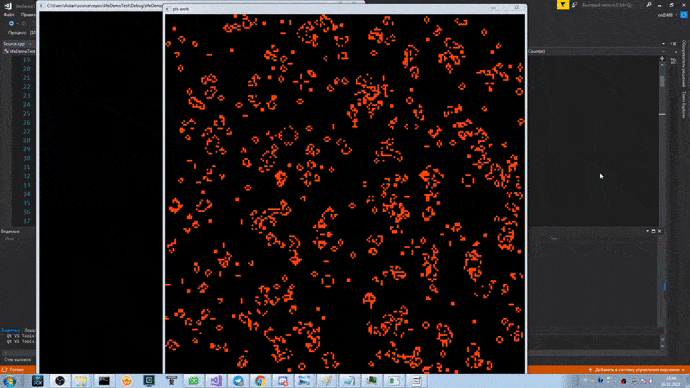

# Game-of-Life
Conway's Game of Life, using C++

Информация о игре "Жизнь" с википедии, по которым была написана данная программа:

Место действия этой игры — «вселенная» — это размеченная на клетки поверхность или плоскость — безграничная, ограниченная, или замкнутая (в пределе — бесконечная плоскость).
Каждая клетка на этой поверхности может находиться в двух состояниях: быть «живой» (заполненной) или быть «мёртвой» (пустой). Клетка имеет восемь соседей, окружающих её.
Распределение живых клеток в начале игры называется первым поколением. Каждое следующее поколение рассчитывается на основе предыдущего по таким правилам:
в пустой (мёртвой) клетке, рядом с которой ровно три живые клетки, зарождается жизнь;
если у живой клетки есть две или три живые соседки, то эта клетка продолжает жить; в противном случае, если соседей меньше двух или больше трёх, клетка умирает («от одиночества» или «от перенаселённости»)
Игра прекращается, если
на поле не останется ни одной «живой» клетки
конфигурация на очередном шаге в точности (без сдвигов и поворотов) повторит себя же на одном из более ранних шагов (складывается периодическая конфигурация)
при очередном шаге ни одна из клеток не меняет своего состояния (складывается стабильная конфигурация; предыдущее правило, вырожденное до одного шага назад)

Процесс игры "жизнь":

